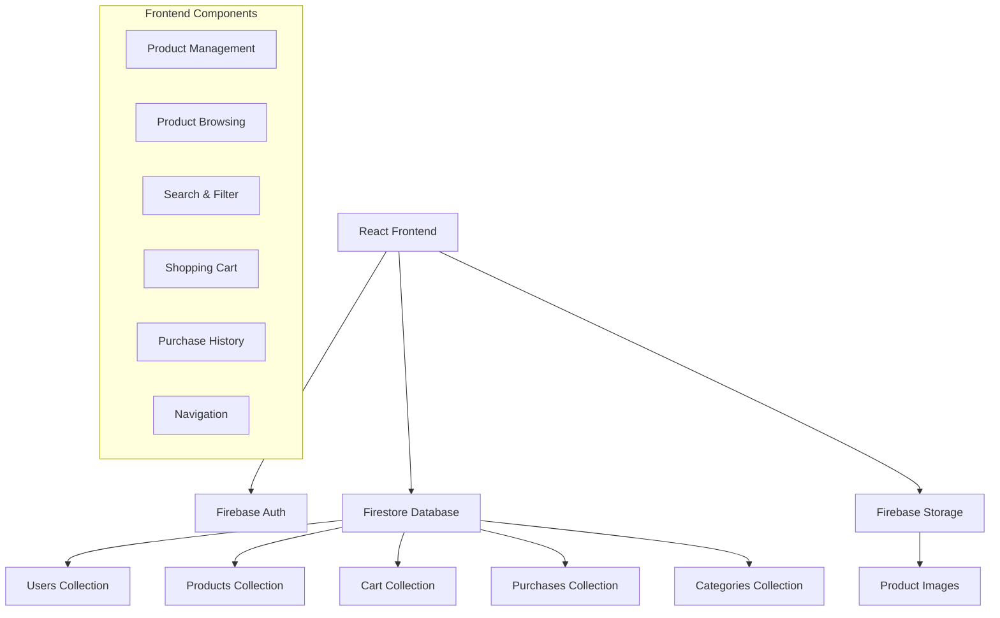
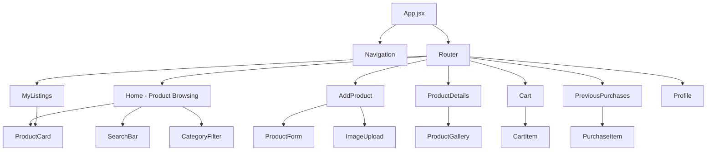

# EcoFinds Marketplace Features Design

## Overview

This design document outlines the architecture and implementation approach for expanding EcoFinds into a comprehensive marketplace for pre-owned goods. The system will be built using React, Firebase Firestore, and Firebase Storage, following the established authentication patterns and color scheme.

## Architecture

### High-Level Architecture



### Component Architecture



## Components and Interfaces

### Core Services

#### ProductService
```javascript
class ProductService {
  // CRUD operations
  async createProduct(productData, images)
  async getProducts(filters = {})
  async getProductById(id)
  async updateProduct(id, updates)
  async deleteProduct(id)
  
  // Search and filter
  async searchProducts(query)
  async getProductsByCategory(category)
  async getProductsBySeller(userId)
}
```

#### CartService
```javascript
class CartService {
  async addToCart(userId, productId)
  async removeFromCart(userId, productId)
  async getCart(userId)
  async clearCart(userId)
  async getCartCount(userId)
}
```

#### PurchaseService
```javascript
class PurchaseService {
  async createPurchase(userId, cartItems)
  async getPurchaseHistory(userId)
  async getPurchaseById(id)
}
```

#### ImageService
```javascript
class ImageService {
  async uploadImage(file, path)
  async deleteImage(url)
  async resizeImage(file, maxWidth, maxHeight)
}
```

### Data Models

#### Product Model
```javascript
{
  id: string,
  title: string,
  description: string,
  price: number,
  category: string,
  images: string[], // Firebase Storage URLs
  sellerId: string,
  sellerName: string,
  sellerEmail: string,
  condition: string, // 'excellent', 'good', 'fair', 'poor'
  status: string, // 'available', 'sold', 'reserved'
  createdAt: timestamp,
  updatedAt: timestamp,
  location: string,
  tags: string[]
}
```

#### Cart Model
```javascript
{
  userId: string,
  items: [{
    productId: string,
    addedAt: timestamp
  }]
}
```

#### Purchase Model
```javascript
{
  id: string,
  buyerId: string,
  sellerId: string,
  productId: string,
  productSnapshot: object, // Product data at time of purchase
  amount: number,
  purchaseDate: timestamp,
  status: string // 'completed', 'pending', 'cancelled'
}
```

### Page Components

#### Home.jsx (Enhanced)
- Product grid display
- Search bar integration
- Category filter sidebar
- Floating "Add Product" button
- Pagination for large product sets

#### AddProduct.jsx
- Multi-step form (Basic Info → Images → Review)
- Image upload with preview
- Category dropdown
- Price validation
- Draft saving capability

#### MyListings.jsx
- User's product grid
- Edit/Delete actions
- Status indicators (available/sold)
- Performance metrics (views, inquiries)

#### ProductDetails.jsx
- Image gallery with zoom
- Seller information card
- "Add to Cart" button
- Similar products section
- Contact seller functionality

#### Cart.jsx
- Cart items list
- Remove item functionality
- Total calculation
- Checkout process
- Empty cart state

#### PreviousPurchases.jsx
- Purchase history list
- Purchase details modal
- Reorder functionality
- Download receipts

### Shared Components

#### ProductCard.jsx
```javascript
// Reusable product display component
// Used in Home, MyListings, Cart, etc.
// Props: product, showActions, onEdit, onDelete, onAddToCart
```

#### SearchBar.jsx
```javascript
// Search input with debouncing
// Real-time search suggestions
// Search history
```

#### CategoryFilter.jsx
```javascript
// Category selection component
// Product count per category
// Clear filters option
```

#### ImageUpload.jsx
```javascript
// Drag & drop image upload
// Multiple image support
// Image preview and reordering
// Progress indicators
```

## Data Models

### Firestore Collections Structure

```
/users/{userId}
  - displayName, email, etc. (existing)

/products/{productId}
  - title, description, price, category
  - images[], sellerId, sellerName
  - condition, status, location
  - createdAt, updatedAt
  - tags[]

/categories/{categoryId}
  - name, description, icon
  - productCount, isActive

/carts/{userId}
  - items: [{ productId, addedAt }]
  - updatedAt

/purchases/{purchaseId}
  - buyerId, sellerId, productId
  - productSnapshot, amount
  - purchaseDate, status

/userStats/{userId}
  - totalListings, totalSales
  - totalPurchases, joinDate
  - rating, reviewCount
```

### Firebase Storage Structure

```
/product-images/{productId}/{imageId}.jpg
/user-avatars/{userId}/avatar.jpg
/thumbnails/{productId}/{imageId}_thumb.jpg
```

## Error Handling

### Error Categories
1. **Network Errors** - Connection issues, timeouts
2. **Authentication Errors** - Unauthorized access
3. **Validation Errors** - Invalid form data
4. **Storage Errors** - Image upload failures
5. **Database Errors** - Firestore operation failures

### Error Handling Strategy
- Global error boundary for unhandled errors
- Service-level error handling with retry logic
- User-friendly error messages
- Offline capability with local caching
- Error logging for debugging

## Testing Strategy

### Unit Testing
- Service layer functions
- Utility functions
- Component logic

### Integration Testing
- Firebase operations
- Authentication flows
- Image upload processes

### End-to-End Testing
- Complete user journeys
- Product creation to purchase flow
- Search and filter functionality

### Performance Testing
- Large product datasets
- Image loading optimization
- Search response times

## Security Considerations

### Firestore Security Rules
```javascript
// Products collection
match /products/{productId} {
  allow read: if true; // Public reading
  allow create: if request.auth != null && 
    request.auth.uid == resource.data.sellerId;
  allow update, delete: if request.auth != null && 
    request.auth.uid == resource.data.sellerId;
}

// Carts collection
match /carts/{userId} {
  allow read, write: if request.auth != null && 
    request.auth.uid == userId;
}

// Purchases collection
match /purchases/{purchaseId} {
  allow read: if request.auth != null && 
    (request.auth.uid == resource.data.buyerId || 
     request.auth.uid == resource.data.sellerId);
  allow create: if request.auth != null && 
    request.auth.uid == request.resource.data.buyerId;
}
```

### Data Validation
- Server-side validation for all inputs
- Image file type and size restrictions
- Price range validation
- XSS prevention in user content

## Performance Optimization

### Frontend Optimization
- Lazy loading for images
- Virtual scrolling for large lists
- Component memoization
- Bundle splitting by routes

### Backend Optimization
- Firestore query optimization
- Image compression and thumbnails
- Caching strategies
- Pagination implementation

### SEO Considerations
- Server-side rendering for product pages
- Meta tags for social sharing
- Structured data markup
- Sitemap generation

## Accessibility

### WCAG Compliance
- Keyboard navigation support
- Screen reader compatibility
- Color contrast requirements
- Focus management
- Alternative text for images

### Mobile Responsiveness
- Touch-friendly interface
- Responsive grid layouts
- Mobile-optimized forms
- Gesture support for image galleries